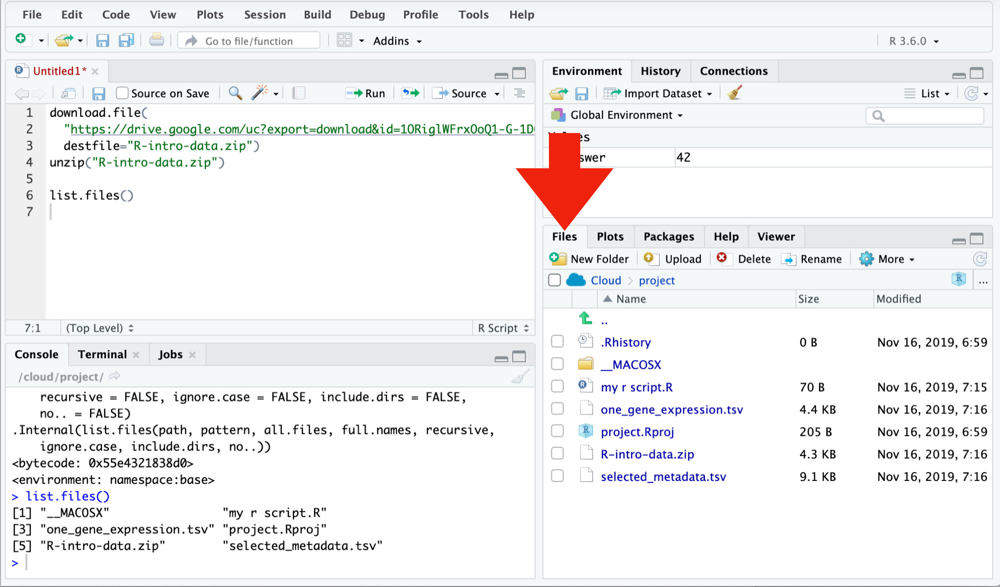

# Data frames


*Data frame* is R's name for tabular data. We generally want each row in a data frame to represent a unit of observation, and each column to contain a different type of information about the units of observation. Tabular data in this form is called ["tidy data"](http://vita.had.co.nz/papers/tidy-data.html).

Today we will be using a collection of modern packages collectively known as the [Tidyverse](https://www.tidyverse.org/). R and its predecessor S have a history dating back to 1976. The Tidyverse fixes some dubious design decisions baked into "base R", including having its own slightly improved form of data frame, which is called a *tibble*. Sticking to the Tidyverse where possible is generally safer, Tidyverse packages are more willing to generate errors rather than ignore problems.


## Setting up

Our first step is to download the files we need and to install the Tidyverse. This is the one step where we ask you to copy and paste some code:


If using RStudio Cloud, you might need to switch to R version 3.5.3 to successfully install Tidyverse. Use the drop-down in the top right corner of the page.

People also sometimes have problems installing all the packages in Tidyverse on Windows machines. If you run into problems you may have more success installing individual packages.


```r
install.packages(c("dplyr","readr","tidyr","ggplot2"))
```

We need to load the `tidyverse` package in order to use it.


```r
library(tidyverse)

# OR
library(dplyr)
library(readr)
library(tidyr)
library(ggplot2)
```

The `tidyverse` package loads various other packages, setting up a modern R environment. In this section we will be using functions from the `dplyr`, `readr` and `tidyr` packages.

R is a language with mini-languages within it that solve specific problem domains. `dplyr` is such a mini-language, a set of "verbs" (functions) that work well together. `dplyr`, with the help of `tidyr` for some more complex operations, provides a way to perform most manipulations on a data frame that you might need.


## Loading data

We will use the `read_tsv` function from `readr` to load a data set. (See also `read.csv` in base R.) TSV stands for Tab Separated Values, and is a text format used to store tabular data. The first few lines of the file we are loading are shown below. Conventionally the first line contains column headings.

```
th_sampleid   disease                             age_at_dx
TH34_1150_S02 Ewing sarcoma                             16   
TH34_1162_S01 Ewing sarcoma                             15   
TH34_1163_S01 embryonal rhabdomyosarcoma                18   
TH34_1179_S01 colon adenocarcinoma                      24   
```


```r
sample_metadata <- read_tsv("selected_metadata.tsv")
```

```
## Parsed with column specification:
## cols(
##   sample = col_character(),
##   disease = col_character(),
##   age_at_dx = col_double(),
##   pedaya = col_character(),
##   gender = col_character(),
##   site_id = col_character()
## )
```

`read_tsv` has guessed the type of data each column holds:

* `<chr>` - character strings
* `<dbl>` - numerical values. Technically these are "doubles", which is a way of storing numbers with 15 digits precision.

We will also encounter:

* `<lgl>` - logical values, `TRUE` or `FALSE`.
* `<int>` - integers, a fancy name for whole numbers.
* `<fct>` - factors, categorical data. We will get to this shortly.


You can also see this data frame referring to itself as "a tibble". This is the Tidyverse's improved form of data frame. Tibbles present themselves more conveniently than base R data frames. Base R data frames don't show the type of each column, and output every row when you try to view them.


### Tip {- .tip}

A data frame can also be created from vectors, with the `tibble` function. (See also `data.frame` in base R.) For example:


```r
tibble(foo=c(10,20,30), bar=c("a","b","c"))
```

```
## # A tibble: 3 x 2
##     foo bar  
##   <dbl> <chr>
## 1    10 a    
## 2    20 b    
## 3    30 c
```

The argument names become column names in the data frame.

### Tip {- .tip}

The *path* to the file on our server is `"selected_metadata.tsv"`. This says the file `"selected_metadata.tsv"` is in your working directory. Sometimes a file is in a subdirectory, in which case the file and directory names are  separated by `/`. Your working directory is shown at the top of the console pane. The path needed might be different on your own computer, depending where you downloaded the file.

One way to work out the correct path is to find the file in the file browser pane.




## Exploring

The `View` function gives us a spreadsheet-like view of the data frame.

```
View(sample_metadata)
```

`print` with the `n` argument can be used to show more than the first 10 rows on the console.


```r
print(sample_metadata, n=200)
```

We can extract details of the data frame with further functions:


```r
nrow(sample_metadata)
```

```
## [1] 134
```

```r
ncol(sample_metadata)
```

```
## [1] 6
```

```r
colnames(sample_metadata)
```

```
## [1] "sample"    "disease"   "age_at_dx" "pedaya"    "gender"    "site_id"
```

```r
summary(sample_metadata)
```

```
##     sample            disease            age_at_dx         pedaya         
##  Length:134         Length:134         Min.   : 0.200   Length:134        
##  Class :character   Class :character   1st Qu.: 4.675   Class :character  
##  Mode  :character   Mode  :character   Median :11.615   Mode  :character  
##                                        Mean   :13.061                     
##                                        3rd Qu.:16.000                     
##                                        Max.   :76.000                     
##                                        NA's   :20                         
##     gender            site_id         
##  Length:134         Length:134        
##  Class :character   Class :character  
##  Mode  :character   Mode  :character  
##                                       
##                                       
##                                       
## 
```


## Indexing data frames

Data frames can be subset using `[row,column]` syntax.


```r
sample_metadata[4,2]
```

```
## # A tibble: 1 x 1
##   disease       
##   <chr>         
## 1 hepatoblastoma
```

Note that while this is a single value, it is still wrapped in a data frame. (This is a behaviour specific to Tidyverse data frames.) More on this in a moment.

Columns can be given by name.


```r
sample_metadata[4,"disease"]
```

```
## # A tibble: 1 x 1
##   disease       
##   <chr>         
## 1 hepatoblastoma
```

The column or row may be omitted, thereby retrieving the entire row or column.


```r
sample_metadata[4,]
```

```
## # A tibble: 1 x 6
##   sample       disease       age_at_dx pedaya            gender     site_id
##   <chr>        <chr>             <dbl> <chr>             <chr>      <chr>  
## 1 TH03_0104_S… hepatoblasto…      0.33 Yes, age < 30 ye… not repor… TH03
```

```r
sample_metadata[,"disease"]
```

```
## # A tibble: 134 x 1
##    disease                                 
##    <chr>                                   
##  1 acute leukemia of ambiguous lineage     
##  2 acute leukemia of ambiguous lineage     
##  3 spindle cell/sclerosing rhabdomyosarcoma
##  4 hepatoblastoma                          
##  5 spindle cell/sclerosing rhabdomyosarcoma
##  6 Ewing sarcoma                           
##  7 hepatoblastoma                          
##  8 acute lymphoblastic leukemia            
##  9 synovial sarcoma                        
## 10 synovial sarcoma                        
## # … with 124 more rows
```

Multiple rows or columns may be retrieved using a vector.


```r
rows_wanted <- c(1,3,5)
sample_metadata[rows_wanted,]
```

```
## # A tibble: 3 x 6
##   sample     disease                 age_at_dx pedaya      gender   site_id
##   <chr>      <chr>                       <dbl> <chr>       <chr>    <chr>  
## 1 TH03_0010… acute leukemia of ambi…        NA Yes, age <… female   TH03   
## 2 TH03_0103… spindle cell/sclerosin…         8 Yes, age <… not rep… <NA>   
## 3 TH03_0105… spindle cell/sclerosin…        17 Yes, age <… not rep… TH03
```

Vector indexing can also be written on a single line.


```r
sample_metadata[c(1,3,5),]
```

```
## # A tibble: 3 x 6
##   sample     disease                 age_at_dx pedaya      gender   site_id
##   <chr>      <chr>                       <dbl> <chr>       <chr>    <chr>  
## 1 TH03_0010… acute leukemia of ambi…        NA Yes, age <… female   TH03   
## 2 TH03_0103… spindle cell/sclerosin…         8 Yes, age <… not rep… <NA>   
## 3 TH03_0105… spindle cell/sclerosin…        17 Yes, age <… not rep… TH03
```

```r
sample_metadata[1:7,]
```

```
## # A tibble: 7 x 6
##   sample     disease                 age_at_dx pedaya      gender   site_id
##   <chr>      <chr>                       <dbl> <chr>       <chr>    <chr>  
## 1 TH03_0010… acute leukemia of ambi…     NA    Yes, age <… female   TH03   
## 2 TH03_0010… acute leukemia of ambi…     11    Yes, age <… female   TH03   
## 3 TH03_0103… spindle cell/sclerosin…      8    Yes, age <… not rep… <NA>   
## 4 TH03_0104… hepatoblastoma               0.33 Yes, age <… not rep… TH03   
## 5 TH03_0105… spindle cell/sclerosin…     17    Yes, age <… not rep… TH03   
## 6 TH03_0106… Ewing sarcoma               15    Yes, age <… not rep… TH03   
## 7 TH03_0107… hepatoblastoma               1    Yes, age <… not rep… TH03
```


## Columns are vectors

Ok, so how do we actually get data out of a data frame?

Under the hood, a data frame is a list of column vectors. We can use `$` to retrieve columns. Occasionally it is also useful to use `[[ ]]` to retrieve columns, for example if the column name we want is stored in a variable.


```r
head( sample_metadata$disease )
```

```
## [1] "acute leukemia of ambiguous lineage"     
## [2] "acute leukemia of ambiguous lineage"     
## [3] "spindle cell/sclerosing rhabdomyosarcoma"
## [4] "hepatoblastoma"                          
## [5] "spindle cell/sclerosing rhabdomyosarcoma"
## [6] "Ewing sarcoma"
```

```r
head( sample_metadata[["disease"]] )
```

```
## [1] "acute leukemia of ambiguous lineage"     
## [2] "acute leukemia of ambiguous lineage"     
## [3] "spindle cell/sclerosing rhabdomyosarcoma"
## [4] "hepatoblastoma"                          
## [5] "spindle cell/sclerosing rhabdomyosarcoma"
## [6] "Ewing sarcoma"
```

To get the "disease" value of the 4th row as above, but unwrapped, we can use:


```r
sample_metadata$disease[4]
```

```
## [1] "hepatoblastoma"
```


## Logical indexing

A method of indexing that we haven't discussed yet is logical indexing. Instead of specifying the row number or numbers that we want, we can give a logical vector which is `TRUE` for the rows we want and `FALSE` otherwise. This can also be used with vectors.

We will first do this in a slightly verbose way in order to understand it, then learn a more concise way to do this using the `dplyr` package.


```r
is_ewing_sarcoma <- sample_metadata$disease == "Ewing sarcoma"

head(is_ewing_sarcoma)
```

```
## [1] FALSE FALSE FALSE FALSE FALSE  TRUE
```

```r
sum(is_ewing_sarcoma)
```

```
## [1] 7
```

`sum` treats TRUE as 1 and FALSE as 0, so it tells us the number of TRUE elements in the vector.

We can use this logical vector to get the glioma samples from `sample_metadata`:


```r
sample_metadata[is_ewing_sarcoma,]
```

```
## # A tibble: 7 x 6
##   sample       disease       age_at_dx pedaya           gender      site_id
##   <chr>        <chr>             <dbl> <chr>            <chr>       <chr>  
## 1 TH03_0106_S… Ewing sarcoma        15 Yes, age < 30 y… not report… TH03   
## 2 TH34_1150_S… Ewing sarcoma        16 Yes, age < 30 y… male        <NA>   
## 3 TH34_1150_S… Ewing sarcoma        16 Yes, age < 30 y… male        <NA>   
## 4 TH34_1162_S… Ewing sarcoma        15 Yes, age < 30 y… female      <NA>   
## 5 TH34_1240_S… Ewing sarcoma        16 Yes, age < 30 y… male        TH34   
## 6 TH03_0014_S… Ewing sarcoma         4 Yes, age < 30 y… male        TH03   
## 7 TH03_0157_S… Ewing sarcoma        60 No               not report… TH03
```

Comparison operators available are:

* `x == y ` -- "equal to"
* `x != y ` -- "not equal to"
* `x < y  ` -- "less than"
* `x > y  ` -- "greater than"
* `x <= y ` -- "less than or equal to"
* `x >= y ` -- "greater than or equal to"

More complicated conditions can be constructed using logical operators:

* `a & b ` -- "and", TRUE only if both `a` and `b` are TRUE.
* `a | b ` -- "or", TRUE if either `a` or `b` or both are TRUE.
* `! a   ` -- "not" , TRUE if `a` is FALSE, and FALSE if `a` is TRUE.

The `age_at_dx` column of `sample_metadata` tells the age at which the person was diagnosed. We could see which gliomas occured in people over 65 with:


```r
ewing_sarcoma_in_male <- is_ewing_sarcoma & sample_metadata$gender == "male"

sample_metadata[ewing_sarcoma_in_male,]
```

```
## # A tibble: 4 x 6
##   sample        disease       age_at_dx pedaya              gender site_id
##   <chr>         <chr>             <dbl> <chr>               <chr>  <chr>  
## 1 TH34_1150_S01 Ewing sarcoma        16 Yes, age < 30 years male   <NA>   
## 2 TH34_1150_S02 Ewing sarcoma        16 Yes, age < 30 years male   <NA>   
## 3 TH34_1240_S01 Ewing sarcoma        16 Yes, age < 30 years male   TH34   
## 4 TH03_0014_S01 Ewing sarcoma         4 Yes, age < 30 years male   TH03
```

`ewing_sarcoma_in_male` seems like it should be kept within our `sample_metadata` data frame for future use. We can add it as a new column of the data frame with:


```r
sample_metadata$ewing_sarcoma_in_male <- ewing_sarcoma_in_male

sample_metadata
```

```
## # A tibble: 134 x 7
##    sample  disease      age_at_dx pedaya   gender  site_id ewing_sarcoma_i…
##    <chr>   <chr>            <dbl> <chr>    <chr>   <chr>   <lgl>           
##  1 TH03_0… acute leuke…     NA    Yes, ag… female  TH03    FALSE           
##  2 TH03_0… acute leuke…     11    Yes, ag… female  TH03    FALSE           
##  3 TH03_0… spindle cel…      8    Yes, ag… not re… <NA>    FALSE           
##  4 TH03_0… hepatoblast…      0.33 Yes, ag… not re… TH03    FALSE           
##  5 TH03_0… spindle cel…     17    Yes, ag… not re… TH03    FALSE           
##  6 TH03_0… Ewing sarco…     15    Yes, ag… not re… TH03    FALSE           
##  7 TH03_0… hepatoblast…      1    Yes, ag… not re… TH03    FALSE           
##  8 TH03_0… acute lymph…      0.2  Yes, ag… male    TH03    FALSE           
##  9 TH03_0… synovial sa…     NA    Yes, ag… male    TH03    FALSE           
## 10 TH03_0… synovial sa…     17    Yes, ag… male    TH03    FALSE           
## # … with 124 more rows
```


### Challenge: logical indexing {- .challenge}


1. Which samples are gliomas?

2. Which samples are in neither ewing sarcoma nor from males?

2. How many samples are from people over 65?


### A `dplyr` shorthand

The above method is a little laborious. We have to keep mentioning the name of the data frame, and there is a lot of punctuation to keep track of. `dplyr` provides a slightly magical function called `filter` which lets us write more concisely. For example:


```r
filter(sample_metadata, sample_metadata$gender == "male" & disease == "Ewing sarcoma")
```

```
## # A tibble: 4 x 7
##   sample    disease   age_at_dx pedaya     gender site_id ewing_sarcoma_in…
##   <chr>     <chr>         <dbl> <chr>      <chr>  <chr>   <lgl>            
## 1 TH34_115… Ewing sa…        16 Yes, age … male   <NA>    TRUE             
## 2 TH34_115… Ewing sa…        16 Yes, age … male   <NA>    TRUE             
## 3 TH34_124… Ewing sa…        16 Yes, age … male   TH34    TRUE             
## 4 TH03_001… Ewing sa…         4 Yes, age … male   TH03    TRUE
```

In the second argument, we are able to refer to columns of the data frame as though they were variables. The code is beautiful, but also opaque. It's important to understand that under the hood we are creating and combining logical vectors.


## Factors

The `count` function from `dplyr` can help us understand the contents of some of the columns in `sample_metadata`. `count` is also *magical*, we can refer to columns of the data frame directly in the arguments to `count`.


```r
count(sample_metadata, pedaya)
```

```
## # A tibble: 2 x 2
##   pedaya                  n
##   <chr>               <int>
## 1 No                      8
## 2 Yes, age < 30 years   126
```

```r
count(sample_metadata, ewing_sarcoma_in_male)
```

```
## # A tibble: 2 x 2
##   ewing_sarcoma_in_male     n
##   <lgl>                 <int>
## 1 FALSE                   130
## 2 TRUE                      4
```

Maybe you want the different categories in `pedaya` to be in a different order, with "Yes" coming first. This comes up quite often, for example when sorting or plotting categorical data. R's solution is a further type of vector called a *factor* (think a factor of an experimental design). A factor holds categorical data, and has an associated ordered set of *levels*. It is otherwise quite similar to a character vector.

Any sort of vector can be converted to a factor using the `factor` function. This function defaults to placing the levels in alphabetical order, but takes a `levels` argument that can override this.


```r
head( factor(sample_metadata$pedaya, levels=c("Yes, age < 30 years","No")) )
```

```
## [1] Yes, age < 30 years Yes, age < 30 years Yes, age < 30 years
## [4] Yes, age < 30 years Yes, age < 30 years Yes, age < 30 years
## Levels: Yes, age < 30 years No
```

We should modify the `pedaya` column of the `sample_metadata` table in order to use this:


```r
sample_metadata$pedaya <- factor(sample_metadata$pedaya,
                                 c("Yes, age < 30 years","No"))
```

`count` now produces the desired order of output:


```r
count(sample_metadata, pedaya)
```

```
## # A tibble: 2 x 2
##   pedaya                  n
##   <fct>               <int>
## 1 Yes, age < 30 years   126
## 2 No                      8
```


We can count two categorical columns at once.


```r
count(sample_metadata, pedaya, ewing_sarcoma_in_male)
```

```
## # A tibble: 3 x 3
##   pedaya              ewing_sarcoma_in_male     n
##   <fct>               <lgl>                 <int>
## 1 Yes, age < 30 years FALSE                   122
## 2 Yes, age < 30 years TRUE                      4
## 3 No                  FALSE                     8
```


### Challenge: counting {- .challenge}

Investigate how many acute myeloid leukemia samples come from adult or pediatric individuals using `count`


## Sorting

Data frames can be sorted using the `arrange` function in `dplyr`.


```r
arrange(sample_metadata, age_at_dx)
```

```
## # A tibble: 134 x 7
##    sample   disease     age_at_dx pedaya   gender  site_id ewing_sarcoma_i…
##    <chr>    <chr>           <dbl> <fct>    <chr>   <chr>   <lgl>           
##  1 TH03_00… acute lymp…      0.2  Yes, ag… male    TH03    FALSE           
##  2 TH03_01… hepatoblas…      0.33 Yes, ag… not re… TH03    FALSE           
##  3 TARGET-… acute myel…      0.4  Yes, ag… female  TARGET  FALSE           
##  4 TARGET-… acute myel…      0.44 Yes, ag… male    TARGET  FALSE           
##  5 TARGET-… acute myel…      0.72 Yes, ag… male    TARGET  FALSE           
##  6 TH34_13… juvenile m…      0.75 Yes, ag… female  <NA>    FALSE           
##  7 TH03_01… glioma           0.9  Yes, ag… not re… TH03    FALSE           
##  8 TH34_13… myoepithel…      0.96 Yes, ag… male    TH34    FALSE           
##  9 TH03_01… hepatoblas…      1    Yes, ag… not re… TH03    FALSE           
## 10 TH38_14… sarcoma          1.33 Yes, ag… male    TH38    FALSE           
## # … with 124 more rows
```

Numeric columns are sorted in numeric order. Character columns will be sorted in alphabetical order. Factor columns are sorted in order of their levels. The `desc` helper function can be used to sort in descending order.


```r
arrange(sample_metadata, desc(disease))
```

```
## # A tibble: 134 x 7
##    sample   disease      age_at_dx pedaya   gender site_id ewing_sarcoma_i…
##    <chr>    <chr>            <dbl> <fct>    <chr>  <chr>   <lgl>           
##  1 TH03_00… wilms tumor         18 Yes, ag… male   TH03    FALSE           
##  2 TH03_00… wilms tumor         18 Yes, ag… male   TH03    FALSE           
##  3 TH03_01… wilms tumor          6 Yes, ag… male   TH03    FALSE           
##  4 TH34_14… undifferent…        16 Yes, ag… female TH34    FALSE           
##  5 TH03_01… undifferent…         9 Yes, ag… male   TH03    FALSE           
##  6 TH03_00… undifferent…        NA Yes, ag… not r… TH03    FALSE           
##  7 TH03_00… undifferent…        17 Yes, ag… not r… TH03    FALSE           
##  8 TH03_00… undifferent…        17 Yes, ag… not r… TH03    FALSE           
##  9 TH03_00… undifferent…        12 Yes, ag… male   TH03    FALSE           
## 10 TH03_00… undifferent…        12 Yes, ag… male   TH03    FALSE           
## # … with 124 more rows
```


## Joining data frames

Let's move on to a larger data set. These are some gene expression values. 


```r
expression_values <- read_tsv("one_gene_expression.tsv") 
```

### Quiz {.challenge -}

What is the unit of observation in this new data frame?

### {-}

It would be useful to have general information about samples from `sample_metadata` available as columns when we use this data frame. `expression_values` and `sample_metadata` share a column called `sample` which can be used to match rows from one to the other. 


```r
expression_by_disease <- left_join(expression_values, sample_metadata, by=c("sample"))
expression_by_disease
```

```
## # A tibble: 134 x 9
##    Gene  sample expression disease age_at_dx pedaya gender site_id
##    <chr> <chr>       <dbl> <chr>       <dbl> <fct>  <chr>  <chr>  
##  1 ABL1  TCGA-…       4.91 acute …     61    No     female <NA>   
##  2 ABL1  THR24…       4.56 acute …     NA    Yes, … female THR24  
##  3 ABL1  TARGE…       4.48 acute …     NA    Yes, … female TARGET 
##  4 ABL1  TARGE…       3.72 acute …      4.6  Yes, … female TARGET 
##  5 ABL1  TARGE…       2.94 acute …      0.72 Yes, … male   TARGET 
##  6 ABL1  THR24…       4.75 acute …      4.9  Yes, … female THR24  
##  7 ABL1  TCGA-…       5.55 acute …     21    Yes, … female TCGA   
##  8 ABL1  TCGA-…       5.25 acute …     76    No     female TCGA   
##  9 ABL1  TCGA-…       4.94 acute …     NA    No     female TCGA   
## 10 ABL1  TARGE…       4.14 acute …      7.82 Yes, … female TARGET 
## # … with 124 more rows, and 1 more variable: ewing_sarcoma_in_male <lgl>
```

The "left" in "left join" refers to how rows that can't be paired up are handled. `left_join` keeps all rows from the first data frame but not the second. This is a good default when the intent is to attaching some extra information to a data frame. `inner_join` discard all rows that can't be paired up. `full_join` keeps all rows from both data frames. 


## Further reading

We've covered the fundamentals of dplyr and data frames, but there is much more to learn. Notably, we haven't covered the use of the pipe `%>%` to chain `dplyr` verbs together. The ["R for Data Science" book](http://r4ds.had.co.nz/) is an excellent source to learn more. The Monash Data Fluency ["Programming and Tidy data analysis in R" course](https://monashdatafluency.github.io/r-progtidy/) also covers this. 


